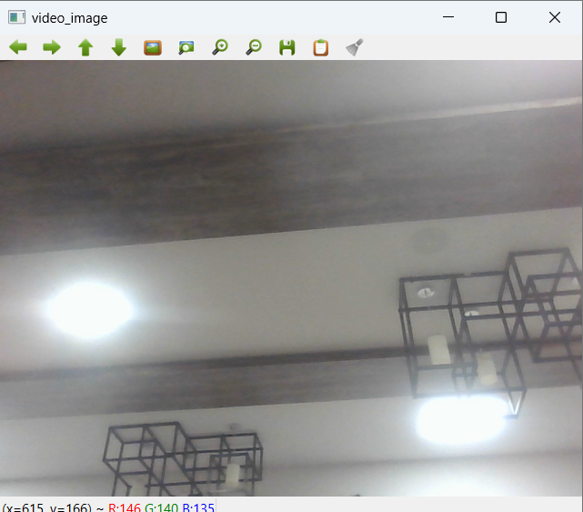

# <p align="center">Image Acquisition from Web Camera</p>

## Aim
To write a python program using OpenCV to capture the image from the web camera and do the following image manipulations.
1. Write the frame as JPG 
2. Display the video 
3. Display the video by resizing the window
4. Rotate and display the video

## Software Used
Anaconda - Python 3.7

## Algorithm
### Step 1:
&emsp;Import cv2 and capture the video using cv2.VideoCapture(0)

### Step 2:
&emsp;Write the captured image using cv2.imwrite("NewPicture.jpg",frame)

### Step 3:
&emsp;Resize the image using cv2.resize() to get a four-split screen.

### Step 4:
&emsp;Rotate the image using cv2.rotate(smaller_frame,cv2.cv2.ROTATE_180)

### Step 5:
&emsp;Display the image until the key to close the window is pressed.
</br>
</br>
</br>
## Program:
Developed By: **Virgil Jovita. A**
</br>
Register No: **212221240062**

## i) Write the frame as JPG file
```py
import cv2
import numpy as np

vidobj = cv2.VideoCapture(0)
while(True):
    ret,frame = vidobj.read()
    cv2.imshow('video_image',frame)
    cv2.imwrite("capture.jpg",frame)
    if cv2.waitKey(1) == ord('q'):
        break
    result = False
vidobj.release()
cv2.destroyAllWindows()
```
## ii) Display the video
```py
vidobj = cv2.VideoCapture(0)
while(True):
    ret,frame = vidobj.read()
    cv2.imshow('video_image',frame)
    if cv2.waitKey(1) == ord('q'):
        break
vidobj.release()
cv2.destroyAllWindows()
```
## iii) Display the video by resizing the window
```py
vidobj = cv2.VideoCapture(0)
while(True):
    ret,frame=vidobj.read()
    width = int(vidobj.get(3))
    height = int(vidobj.get(4))
    
    image = np.zeros(frame.shape,np.uint8)
    smallf = cv2.resize(frame,(0,0),fx=0.5,fy=0.5)
    image[:height//2,:width//2] = smallf
    image[height//2:,:width//2] = smallf
    image[:height//2,width//2:] = smallf
    image[height//2:,width//2:] = smallf
    
    cv2.imshow('quad_screen',image)
    if cv2.waitKey(1) == ord('q'):
        break
vidobj.release()
cv2.destroyAllWindows()
```
## iv) Rotate and display the video
```py
vidobj = cv2.VideoCapture(0)
while(True):
    ret,frame=vidobj.read()
    width = int(vidobj.get(3))
    height = int(vidobj.get(4))
    
    image = np.zeros(frame.shape,np.uint8)
    smallf = cv2.resize(frame,(0,0),fx=0.5,fy=0.5)
    image[:height//2,:width//2] = cv2.rotate(smallf,cv2.ROTATE_180)
    image[height//2:,:width//2] = smallf
    image[:height//2,width//2:] = cv2.rotate(smallf,cv2.ROTATE_180)
    image[height//2:,width//2:] = smallf
    
    cv2.imshow('quad_screen',image)
    if cv2.waitKey(1) == ord('q'):
        break
vidobj.release()
cv2.destroyAllWindows()
```
## Output

### i) Write the frame as JPG image


### ii) Display the video


### iii) Display the video by resizing the window


### iv) Rotate and display the video


## Result:
Thus the image is accessed from webcamera and displayed using openCV.
